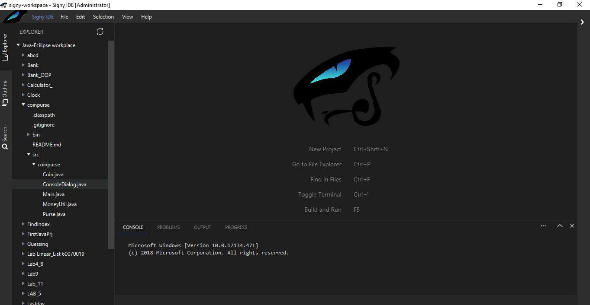
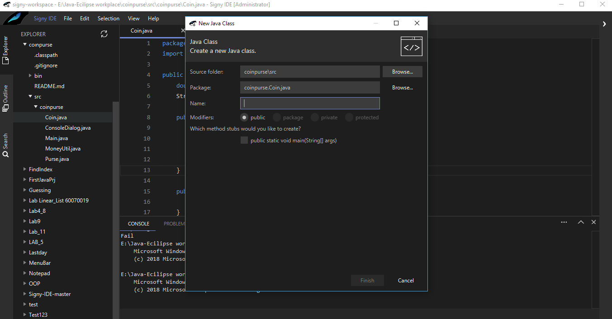
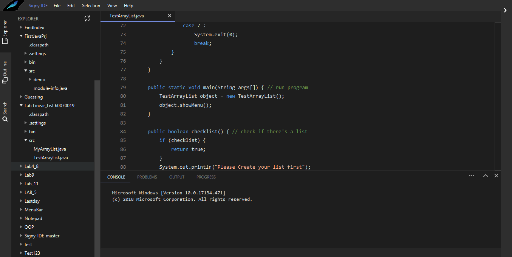
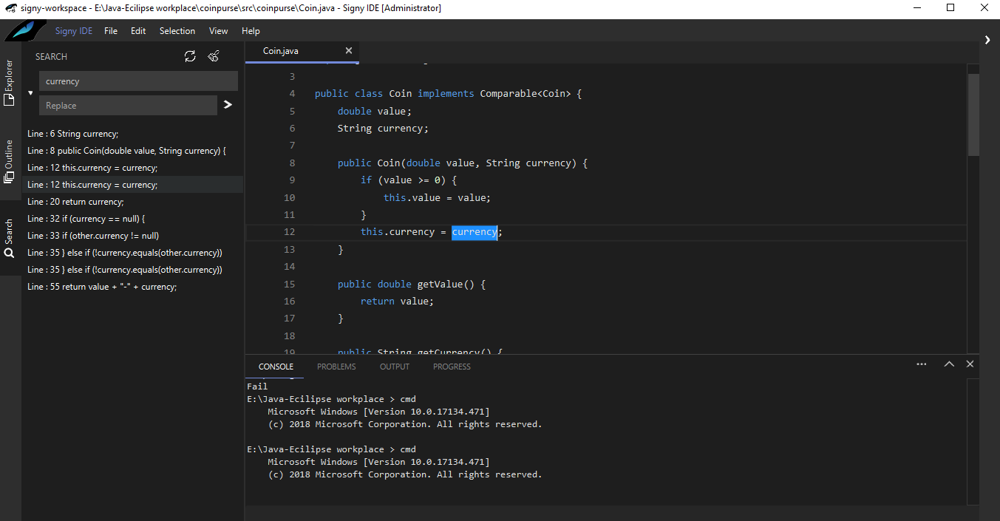
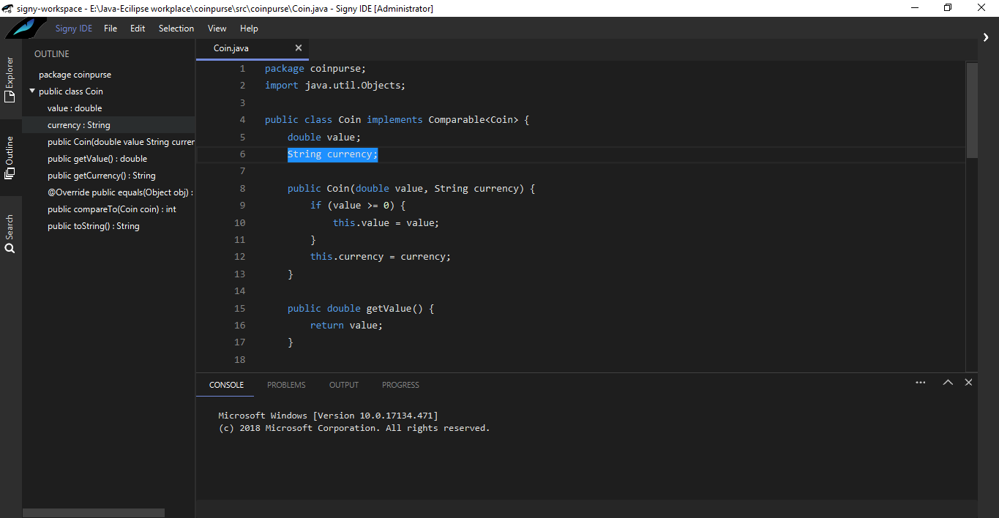
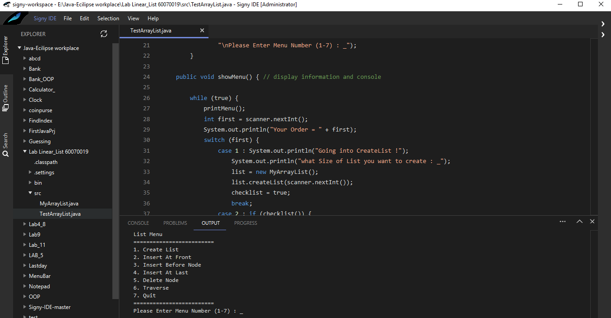

# Signy IDE
### Integrate development environment for Java
  Signy IDE ซอฟต์แวร์ Integrated Development Environment ที่ใช้จัดการกับภาษา Java ที่ช่วยเหลือผู้ที่พัฒนาซอฟต์แวร์ ทำงานโดยการเขียนโปรแกรมและ Compile มีระบบการจัดการ เครื่องมือต่างๆ และทำงานได้รวดเร็ว

#### Require
 - Java Development Kit 10
 
#### Feature
 - Edit code
 - Compile
 - Explore file
 - Find and replace
 - Integrated console

#### APPLICATION PREVIEW
 
 
 
 
 
 
 
